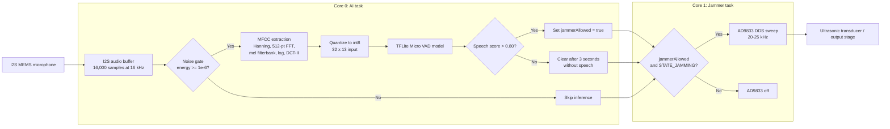

# SpeechShield

ESP32-S3 ultrasonic speech jammer with on-device AI voice activity detection. Listens for speech via I2S MEMS microphone, runs a TensorFlow Lite Micro VAD model, and drives an AD9833 DDS chip to sweep a 20–25 kHz jamming signal when speech is detected.

Dual-core FreeRTOS: Core 0 handles mic capture + inference, Core 1 handles the jammer sweep independently.

---

## Hardware

| Component | Notes |
|-----------|-------|
| ESP32-S3 DevKitC-1-N16R8V | 16MB flash, 8MB PSRAM required |
| AD9833 DDS module | SPI, generates ultrasonic sine wave |
| I2S MEMS microphone | ICS43434 |
| WS2812B RGB LED | Status indicator (currently unused in firmware) |
| LiPo 3.7V 1000mAh+ | ~2–3 hr runtime under continuous jamming |
| TP4056 charger module | With protection circuit |

---

## Pin Assignments

| GPIO | Component | Signal |
|------|-----------|--------|
| 10 | AD9833 | FNC (chip select) |
| 11 | AD9833 | DAT (MOSI) |
| 12 | AD9833 | CLK (SPI clock) |
| 13 | I2S mic | SCK (bit clock) |
| 15 | I2S mic | WS (word select / LRCLK) |
| 16 | I2S mic | SD (data) |
| 48 | WS2812B | Data |
| 6 | — | Battery ADC (unused) |

---

## VAD Model

Custom 3-layer CNN trained for this project on the Google Speech Commands v2 dataset.

| Property | Value |
|----------|-------|
| Architecture | 3-layer CNN |
| Training data | Google Speech Commands v2 (896 samples/class, balanced) |
| Input shape | `[1, 32, 13]` — 32 time frames × 13 MFCCs |
| Frame size | ~32ms per frame at 16kHz |
| Quantization | int8 |
| Model size | 21.6 KB |
| Tensor arena | 32 KB |
| Test accuracy | 97.22% |
| Inference time | ~10ms on ESP32-S3 |
| Training environment | Kaggle + Purdue Scholar HPC |

Quantization parameters (from `vad_model_data.h`):
- Input: scale=`0.489906`, zero_point=`75`
- Output: scale=`0.003906`, zero_point=`-128`

The model expects true MFCCs (FFT → mel filterbank → log → DCT), not raw energy bands.

---

## How It Works



```
[I2S mic] → AITask (Core 0) → TFLite VAD → jammerAllowed flag
                                                    ↓
                              JammerTask (Core 1) → AD9833 sweep (20–25 kHz)
```

**AITask (Core 0)**
1. Reads 16,000 samples (1 sec @ 16kHz, 16-bit mono) from I2S
2. Noise gate skips inference when average energy is below `1e-6`
3. MFCC features (Hanning → 512-pt FFT → mel filterbank → log → DCT-II) → quantized int8 → fed to TFLite input tensor
4. If inference score > 0.80 → set `jammerAllowed = true`, update `lastSpeechTime`
5. If no speech for 3s → set `jammerAllowed = false`

**JammerTask (Core 1)**
- Sweeps 20,000–25,000 Hz in 25 Hz steps, 600µs per step
- Only runs when `jammerAllowed == true && currentState == STATE_JAMMING`

---

## Build & Flash

Requires PlatformIO.

```bash
# Install PlatformIO CLI
pip install platformio

# Clone and enter repo
git clone https://github.com/loroscomurphy/Senior_Design_ESP32-S3_SpeechShield.git
cd Senior_Design_ESP32-S3_SpeechShield

# Build and flash
pio run -t upload

# Serial monitor
pio device monitor --baud 115200
```

The TFLite model binary must be present in `include/vad_model_data.h` as a C array. The constants `kVadFftSize`, `kVadHopLength`, `kVadTimeFrames`, `kVadMfccFeatures`, `kVadInputScale`, `kVadInputZeroPoint`, `kVadOutputScale`, `kVadOutputZeroPoint` must match the model's quantization parameters.

The firmware checks the MFCC frame layout at compile time:

```cpp
(kVadTimeFrames - 1) * kVadHopLength + kVadFftSize <= AUDIO_BUFFER_LEN
```

This prevents the last MFCC frame from reading past the 16,000-sample audio buffer. For 32 frames, a 512-point FFT, and a 16,000-sample buffer, `kVadHopLength = 480` is safe, while `kVadHopLength = 512` would require 16,384 samples and should be avoided unless the buffer is increased.

---

## Filtering Notes

No extra software band-pass filter is required for the TinyML model to receive valid input. The firmware already converts the microphone signal into MFCC features using a Hann window, FFT, mel filterbank, logarithm, and DCT-II before inference. That MFCC pipeline acts as the feature extraction stage expected by the trained model.

A separate hardware or acoustic filtering strategy may still be needed if the ultrasonic output leaks into the microphone path, clips the input stage, or aliases back into the audible/speech band. The current firmware reduces that risk by switching into `STATE_LISTENING`, pausing briefly, clearing the I2S DMA buffer, and then recording the next audio window before returning to `STATE_JAMMING`.

---

## Tuning

**Noise gate** (`NOISE_GATE_THRESH = 0.000001f`): raise if triggering on HVAC/ambient noise, lower if missing soft speech. Uncomment the `[DSP] Energy Score` serial print to calibrate.

**VAD threshold** (`ACTIVE_SPEECH_THRESH = 0.80f`): raise to reduce false positives, lower to catch quieter speech.

---

## Conclusion

(Eric) The system works by keeping speech detection and signal generation on separate cores. Core 0 listens to the microphone, converts the audio into MFCC features, and runs the TFLite Micro VAD model to decide whether speech is present. Core 1 handles the AD9833 sweep, so the ultrasonic output can keep running while the AI task collects the next audio window.

(Eric) The model is not making a decision from raw volume alone. The noise gate only skips very quiet input. When there is enough audio energy, the firmware builds the same type of MFCC input the model was trained on, quantizes it to int8, and checks the model's speech probability. If the score stays above the threshold, the jammer is allowed to sweep from 20 kHz to 25 kHz. If speech stops for 3 seconds, the firmware turns the sweep off.

(Eric) This keeps the firmware small enough for the ESP32-S3 while still using TinyML for the speech/no-speech decision.

## Fallback Energy-Based Detection

The current firmware build is **TinyML-only**. An energy-based fallback detector is preserved in `AITask()` as a commented-out recovery/testing block, but it is not active in the current build.

If fallback mode is re-enabled later, avoid calling `compute_features()` a second time in the same audio window. The intended fallback path is:

1. Capture the 1-second I2S audio buffer.
2. Try TinyML only when `USE_TFLITE_MODEL` is true and the tensors are valid.
3. Use simple average-energy detection only when TinyML is intentionally disabled or unavailable.

Tune `ENERGY_SPEECH_THRESH` by printing average energy during speech and background noise. Set it higher to reduce false positives from ambient noise and lower to catch quieter speech.

---

## Firmware Safety Checks

The updated firmware adds checks for:

1. Audio buffer allocation failure.
2. I2S driver installation failure.
3. I2S pin configuration failure.
4. TensorFlow Lite model schema mismatch.
5. `AllocateTensors()` failure.
6. Missing or incorrectly typed TFLite input/output tensors.
7. MFCC frame layout exceeding `AUDIO_BUFFER_LEN`.
8. Failed or incomplete I2S reads.
9. FreeRTOS task creation failure.

On fatal setup errors, the firmware prints a serial error, turns the RGB LED red, disables jamming, and halts.

---

## Known Issues

1. **Energy fallback is disabled by design** — the fallback detector is present only as a commented testing/recovery block. The current build should be described as TinyML-only.

2. **Ultrasonic leakage still needs hardware validation** — if the ultrasonic output couples back into the microphone or aliases into the speech band, add acoustic isolation, input protection, or hardware filtering. The current firmware reduces this risk by separating listening and jamming windows, but it does not prove the analog path is immune to leakage.

3. **Status LED is minimal** — the RGB LED is used for fatal error indication only. It does not yet show listening, speech detected, or jamming status during normal operation.

---

## Legal

Ultrasonic jamming devices may be restricted in some jurisdictions. Use only in controlled environments with appropriate authorization.
